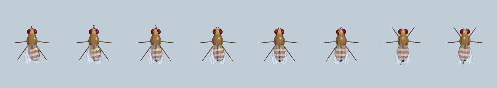
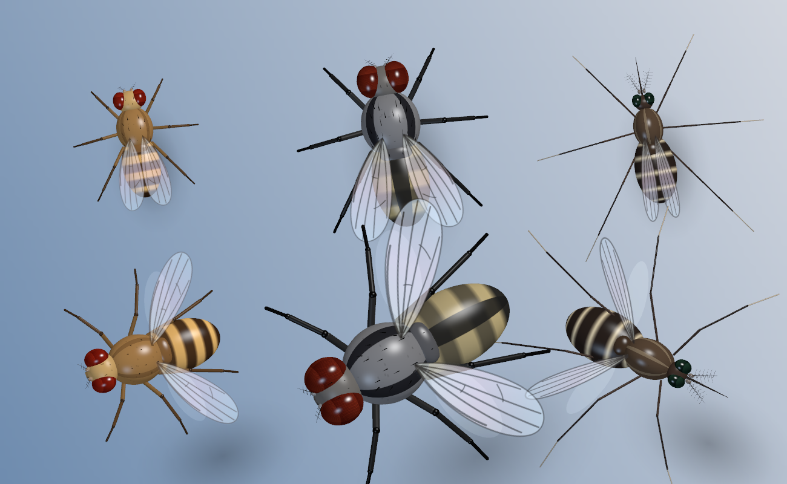
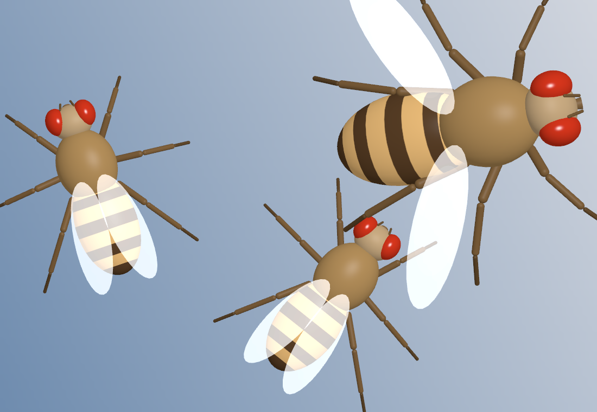
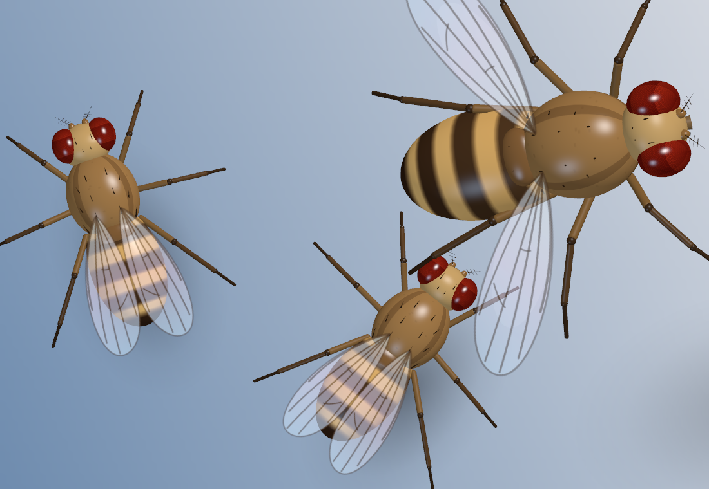

# Buzzkill

**The only desktop pest where the kill is fair.**

https://github.com/user-attachments/assets/dbc4b133-4b55-4880-a431-bee7c533ae76

[Watch on YouTube](https://youtu.be/hnrluK6MwHA) (1:25)

A fruit fly lives on your Mac desktop and is run by a real fruit fly brain:
668 neurons and 18,968 synapses from the FlyWire connectome — the circuit that
spots danger and triggers escape — simulated live. Rush your cursor at it and
the actual Giant Fiber neuron fires and it bolts. Sneak up and you can squish
it. Drop a crumb and it flies over to eat. Leave for lunch and come back to a
swarm, which scatters the moment you move.

It knows where your windows are, when you're typing, what time it is, and
nothing about what any of it means.

Built on [desktop-fly](https://github.com/DenisSergeevitch/desktop-fly) by
**Denis Shiryaev** — the fly, the brain and the body are his. Buzzkill is the
world around it. See [NOTICE](NOTICE) and [ENGINE.md](ENGINE.md).

<!-- GIF: a squish, then a swarm scatter. ~10 s, ≤ 8 MB. -->

## Install

Download `Buzzkill.zip` from [Releases](https://github.com/GhostInTheBus/buzzkill/releases), unzip, drag to
`/Applications`. It is signed but not notarized, so the first launch is
refused; open **System Settings → Privacy & Security** and click **Open Anyway**
once (or `xattr -dr com.apple.quarantine /Applications/Buzzkill.app`).

Or build it (macOS 13+, Xcode Command Line Tools):

```sh
git clone https://github.com/GhostInTheBus/buzzkill.git && cd buzzkill
./package.sh --install
```

A 🪰 appears in the menu bar. Everything below lives there.

## How to play

- **Add 5 Flies** (`5`) — five more fly in and stay until you squish or shoo them.
- **Four kinds of splat**, decided by how you hit it: a moving cursor *smears*
  along its path, a dead-center click *bursts* (rays, far-flung drops, a
  detached leg), a clip at the edge of the hitbox only *glances* (small mark,
  the body thrown clear), anything else is a round *blot*. Four goo colors.
  The body ends up splayed — wings knocked out, legs bent wrong.
- **Squish** — click a grounded fly. Approach slowly: a fast cursor trips the
  real looming → escape reflex before your click lands. **Difficulty** (`x`)
  doesn't change the hitbox (always 26 px); it dulls or sharpens the fly's
  senses — what reaches its looming detectors and ears. An easy fly is a dull
  fly, not a scripted one.
- **Misses are audible — and shown.** Swing and miss near a fly and you'll hear
  a short zip. If the getaway was the real thing — the brain fly's Giant Fiber
  fired before your click — the brain window flashes both Giant Fibers with
  "⚡ Giant Fiber fired N ms before your click" and the menu bar reads 🪰⚡ for a
  moment. It only says so when it's true; a brainless fly or a bad aim gets
  just the zip.
- **Watch the brain** (`b`) — 23,210 real soma positions, with the 668
  simulated neurons spiking live. Click a region to stimulate it, drag to
  orbit, scroll to zoom, `f` for fullscreen, `e` for an escape test.
- **Crumbs** (`m`) — carry one on the cursor, click to drop. Every fly comes,
  and more arrive from off-screen: each crumb makes room for three extra flies
  (up to +12) who show up within seconds and stay. That's how you raise a crowd
  on purpose. The extra room fades by one every five minutes.
- **Attract to Cursor** (`t`) — park the cursor; the fly flies over and grooms.
- **It stops when you do.** Idle a minute: 30 fps. Idle ten minutes (`i`:
  5/10/30/60): rendering, brain sim, camera and sound all stop — nothing burns
  while you sleep. The display waking (or any input) resumes it, and the
  flies that would have arrived stream in from the edges.
- **Swarms while you're away.** At the desk: a fly every few minutes, up to 4.
  Idle a minute or more: the cap climbs about 1.5 a minute, to 160. Come back
  and your first input scatters everything beyond 4. Shake the cursor hard
  (or wave at the camera) and the room empties until you've been idle again.
- **Camera Swat** (`c`, off by default) — the webcam becomes the fly's eyes.
  Plain frame differencing (no face or hand model) finds movement; how fast it
  *grows* in the frame drives the real LC4/LPLC2 looming detectors (expansion =
  something approaching), the half of the frame it's in picks the eye, a fast
  sweep is wind. Lunge at the screen and the Giant Fiber fires. On-device,
  frames compared and dropped. The one feature that needs a permission.
- **Hearing** — the 16 sensory partners in the circuit are the fly's ears:
  Johnston's organ auditory neurons (JO-A5, JO-B1), 13 of which synapse
  directly onto the Giant Fiber. Loud moments drive them — a typing burst
  (always on, permission-free) or, with **Hearing (mic)** on (`g`), the room's
  loudness over its own ambient level — so sound reaches the escape circuit
  through real wiring. Measured (`--populationtest`, 40 seeds): an approach
  that triggers escape 24 times out of 40 in silence triggers it 34 out of 40
  in a loud room, while sustained maximum noise alone sets it off about once
  every 15–20 s. Stalk quietly. The mic path reads one
  loudness number per buffer from the Mac's built-in mic (Bluetooth inputs are
  refused so AirPods don't drop to call quality); no audio is kept, and the
  app's own splat and zip are ignored.
- **Stats** at the top of the menu: squished, got away, peak swarm, longest
  absence.

## What's real

The 668-neuron circuit and its signed synapses are real FlyWire wiring, run as
leaky-integrate-and-fire neurons at 1 kHz. Escape, steering, grooming and
backward walking are read off the actual cell types (GF, DNa01/02, DNg11, MDN).
A 1,045-neuron MaleCNS circuit drives the six legs.

Scripted: the body animation, flight paths, the approach to food (flies hop to
it — motor-mode walking covers ~1 px/s, measured in `--attracttest`), and the
whole game layer: crumbs, squishing, arrivals, scattering, stats. There is no
feeding or olfactory circuit in the data; the attractant is a synthetic input
in the same spirit as the author's loom.

## How it moves

Measured with `./Buzzkill --motionprofile` (add `--engine` for upstream's raw
motion). The engine's fly changed its mind about 1.5 times a second and
"walked" at 11 px/s — under half a body length a second, 6 px per bout — so it
twitched in place and only really travelled by flying. On top of the same
brain decisions, the app now applies a motion style:

| | engine | Buzzkill |
|---|---|---|
| walking bout / grooming bout | 0.5 s / 0.6 s | 2.2 s / 2.9 s |
| state changes per second | 1.5 | 0.65 |
| walking speed | 11 px/s (0.4 body lengths) | 72 px/s (2.8 body lengths) |
| distance per walk | 6 px | 161 px |

| walking speed, with dashes and stops | — | 52 px/s average, dashes to ~130 |

It commits to a walk or a groom for a randomized bout (escape, darting, sleep
and backing up still interrupt at once); a stride gain lets the leg circuit's
stepping carry the body further — the gait is the circuit's, the distance per
step is a choice; and flights bow to one side with the body facing along the
curve instead of following a ruled line. A walk is a string of dashes and
abrupt stops, the way real flies walk. Grooming cycles three gestures — the
forelegs meet in front of the face and rub, the forelegs wipe the head, the
hind legs reach back and scissor:



The head turns to follow your cursor when it's close. Takeoff starts with a
duck; landing ends with the legs out. `./Buzzkill --posetest out.png
groom|takeoff|landing|flight|head` renders any of these as a contact sheet.

## Other pests



Not every arrival is a fruit fly (`o` toggles this): about one in six is a
**housefly** — half again as big, grey with four black stripes, a lower drone —
and one in eight is a **mosquito**: stilt legs, a needle, feathery antennae, a
whine, and a red splat. Same skeleton, same behavior, different suit; if one of
them ends up carrying the brain, it is a fruit-fly brain in that suit. The first
fly on screen is always a fruit fly. Bigger pests are easier to hit. 160 mixed
insects hold 92 fps here.

## Two looks

| classic (upstream) | detailed (this project, default) |
|---|---|
|  |  |

Same proportions, same skeleton, same behavior — the detailed body restyles it
toward "stylized-real": glass wings with veins you can see the abdomen through,
faceted brick-red eyes, glossy chitin, bristles, legs that taper and darken, a
soft contact shadow that slides away and fades as the fly climbs, and a raking
key light with a cool rim so the body has a shaded side. Switch from the menu
(`y`: detailed → classic → stag beetle). 160 detailed flies hold 85 fps here
(classic: 113); `./Buzzkill --looktest out.png [--detailed] [--actual]` renders
the comparison above.

## Two brains, two licenses

The app runs on either of two extracts of the same circuit:

| | `data/` (default) | `data-malecns/` |
|---|---|---|
| source | FlyWire v783, a female brain | MaleCNS v1.0, a male brain and nerve cord |
| circuit | 668 neurons, 18,968 edges | 665 neurons, 23,795 edges |
| license | **CC BY-NC 4.0** — non-commercial | **CC BY 4.0** — no such limit |
| fit | upstream's | re-fit here; see `data-malecns/PROVENANCE.md` |

Same cell types, same selection rules, same test suites — all pass on both.
On either one the Giant Fiber's strongest sensory inputs turn out to be the
same thing: the auditory neurons of Johnston's organ. `./package.sh --malecns`
builds an app containing only the CC BY data, with the legs and the brain from
one animal. `BUZZKILL_DATA=data-malecns ./Buzzkill` switches at run time. The
menu shows which brain is loaded.

Known differences on male wiring, stated in the provenance file: a sharper
escape threshold, and a Giant Fiber that keeps firing through a sustained loom
instead of being shut down after a spike or two. Neither changes how it plays.

## Diagnostics

```sh
./Buzzkill --simtest --behaviortest --locomotortest   # the engine's suites
./Buzzkill --populationtest                           # the game's rules
tools/test-all.sh                                     # every suite, both brains
./Buzzkill --gfstat                                   # Giant Fiber profile for fitting an extract
./Buzzkill --attracttest                              # attraction, headless
DESKTOPFLY_SWARM_TEST=200 DESKTOPFLY_FPS=1 ./Buzzkill  # stress (240 flies = 120 fps)
```

## License

MIT (code), see [LICENSE](LICENSE) and [NOTICE](NOTICE). Connectome data:
`data/` is FlyWire-derived (CC BY-NC 4.0, non-commercial); `data-malecns/` is
MaleCNS-derived (CC BY 4.0). A build made with `./package.sh --malecns` carries
only the latter. See `data/DATA_LICENSE.md` and `data-malecns/DATA_LICENSE.md`.
